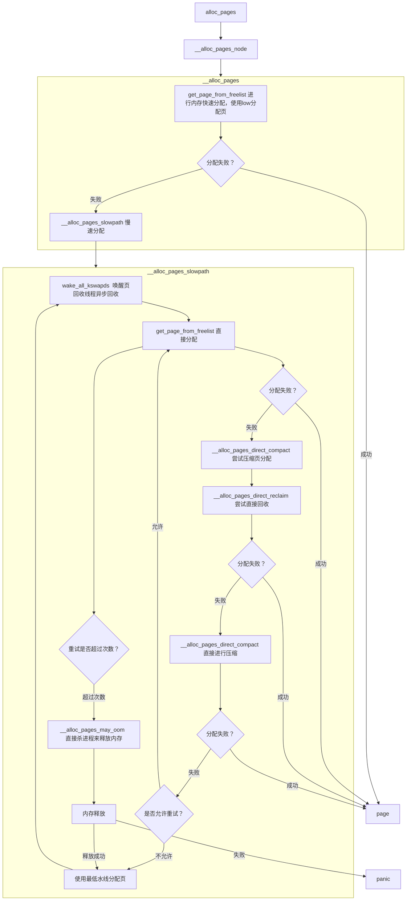
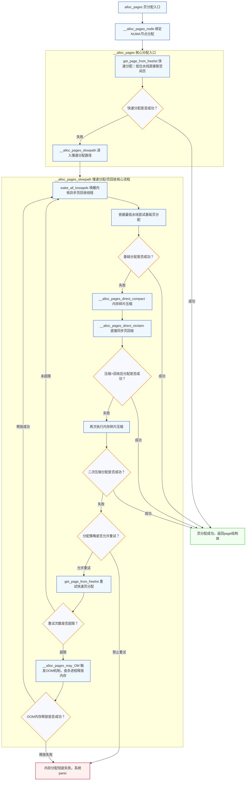

```mermaid
flowchart TD
    alloc_pages
    __alloc_pages_node
    subgraph __alloc_pages
    	A1["get_page_from_freelist 进行内存快速分配，使用low分配页"] 
    	cond1{分配失败？}
    	A2["__alloc_pages_slowpath 慢速分配"]
    end
    subgraph __alloc_pages_slowpath
    	B1["wake_all_kswapds  唤醒页回收线程异步回收"]
    	B2["使用最低水线分配页"]
    	cond2{分配失败？}
    	B3["__alloc_pages_direct_compact 尝试压缩页分配"]
    	B4["__alloc_pages_direct_reclaim 尝试直接回收"]
    	cond3{分配失败？}
    	B5["__alloc_pages_direct_compact 直接进行压缩"]
    	cond4{分配失败？}
    	cond5{是否允许重试？}
    	B6["get_page_from_freelist 直接分配"]
    	cond6{重试是否超过次数？}
    	B7["__alloc_pages_may_oom  直接杀进程来释放内存"]
    	cond7["内存释放"]
    end
    END["page"]
    END1["panic"]
    
    alloc_pages --> 
    __alloc_pages_node -->
    __alloc_pages
    A1 --> cond1
    cond1 -- 成功 --> END
    cond1 -- 失败 --> A2
    A2 --> __alloc_pages_slowpath 
    B2 --> B1 --> B6 --> cond2
    cond2 -- 成功 --> END
    cond2 -- 失败  --> B3
    B3 --> B4 --> cond3
    cond3 -- 成功 --> END
    cond3 -- 失败 --> B5 --> cond4
    cond4 -- 成功 --> END
    cond4 -- 失败 --> cond5
    cond5 -- 允许 --> B6
    cond5 -- 不允许 --> B2
    B6 --> cond6
    cond6 -- 超过次数 --> B7
    B7 --> cond7
    cond7 -- 释放成功 --> B2
    cond7 -- 失败 --> END1
    

```

AI优化后流程

```mermaid


flowchart TD
    %% 定义全局样式，优化展示效果
    classDef func fill:#f0f8ff,stroke:#4169e1,stroke-width:1.5px
    classDef cond fill:#f8f8ff,stroke:#ff8c00,stroke-width:1.5px
    classDef endnode fill:#f0fff0,stroke:#32cd32,stroke-width:1.5px
    classDef errnode fill:#fff0f0,stroke:#dc143c,stroke-width:1.5px

    %% 顶层调用链路
    alloc_pages["alloc_pages 页分配入口"]:::func
    __alloc_pages_node["__alloc_pages_node 绑定NUMA节点分配"]:::func

    %% 快速分配子流程
    subgraph __alloc_pages["__alloc_pages 核心分配入口"]
        A1["get_page_from_freelist 快速分配｜低位水线直接取空闲页"]:::func
        cond1{快速分配是否成功？}:::cond
        A2["__alloc_pages_slowpath 进入慢速分配路径"]:::func
    end

    %% 慢速分配&页回收核心子流程（贴合内核真实时序）
    subgraph __alloc_pages_slowpath["__alloc_pages_slowpath 慢速分配/页回收核心流程"]
        B1["wake_all_kswapds 唤醒内核异步页回收线程"]:::func
        B2["依据最低水线尝试基础页分配"]:::func
        cond2{基础分配是否成功？}:::cond
        
        B3["__alloc_pages_direct_compact 内存碎片压缩"]:::func
        B4["__alloc_pages_direct_reclaim 直接同步页回收"]:::func
        cond3{压缩+回收后分配是否成功？}:::cond
        
        B5["再次执行内存碎片压缩"]:::func
        cond4{二次压缩分配是否成功？}:::cond
        
        cond5{分配策略是否允许重试？}:::cond
        B6["get_page_from_freelist 重试快速页分配"]:::func
        cond6{重试次数是否超限？}:::cond
        
        B7["__alloc_pages_may_OM 触发OOM机制，查杀进程释放内存"]:::func
        cond7{OOM内存释放是否成功？}:::cond
    end

    %% 终止节点
    SUCCESS["页分配成功，返回page结构体"]:::endnode
    PANIC["内存分配彻底失败，系统panic"]:::errnode

    %% 正向调用链路
    alloc_pages --> __alloc_pages_node
    __alloc_pages_node --> __alloc_pages
    
    %% 快速分配分支
    A1 --> cond1
    cond1 -- 成功 --> SUCCESS
    cond1 -- 失败 --> A2
    A2 --> __alloc_pages_slowpath

    %% 慢速分配标准时序（修复原逻辑时序错乱问题）
    B1 --> B2
    B2 --> cond2
    cond2 -- 成功 --> SUCCESS
    cond2 -- 失败 --> B3
    
    B3 --> B4
    B4 --> cond3
    cond3 -- 成功 --> SUCCESS
    cond3 -- 失败 --> B5
    
    B5 --> cond4
    cond4 -- 成功 --> SUCCESS
    cond4 -- 失败 --> cond5
    
    %% 重试分支逻辑
    cond5 -- 允许重试 --> B6
    cond5 -- 禁止重试 --> PANIC
    
    B6 --> cond6
    cond6 -- 未超限 --> B1
    cond6 -- 超限 --> B7
    
    %% OOM兜底逻辑
    B7 --> cond7
    cond7 -- 释放成功 --> B1
    cond7 -- 释放失败 --> PANIC
    

```

# kswapd异步回收

每个内核守护线程，每个NUMA节点一个