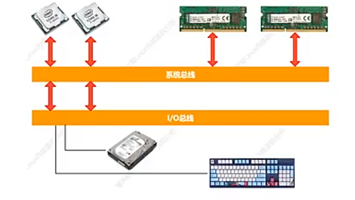
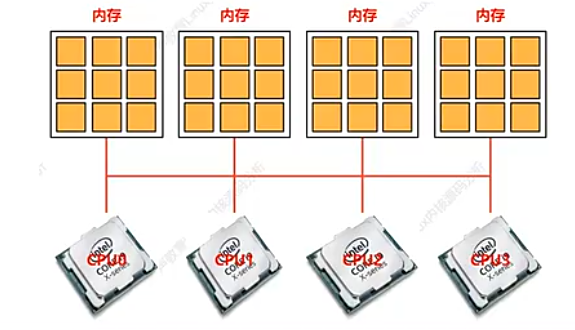

# 实时调度类分析
## 实时调度类

> Linux进程可分为两大类：实时进程和普通进程。实施进程与普通进程根本不同之处，如果系统中有一个实时进程且可执行，那么调度器总是会选择它，除非另有一个优先级更高实时进程。
* SCHED_FIF：没有时间片，再被调度器选择之后，可以运行任意长时间。
* SHCED_RR：有时间片，其值在进程运行时会减少。

## 实时调度实体sched_rt_entity数据结构
表示实时调度实体，包含整个实时调度数据，具体内核源码如下：
```c
struct sched_rt_entity {
	struct list_head		run_list;   // 专门用于加入到优先级队列当中
	unsigned long			timeout;    // 设置的时间超时
	unsigned long			watchdog_stamp; // 用于记录jiffies值
	unsigned int			time_slice; // 时间片
	unsigned short			on_rq;
	unsigned short			on_list;

	struct sched_rt_entity		*back;  // 用于临时从上往连接RT调度实体使用
#ifdef CONFIG_RT_GROUP_SCHED
	struct sched_rt_entity		*parent;    //指向父类RT调度实体
	/* rq on which this entity is (to be) queued: */
    //实时类
	struct rt_rq			*rt_rq; // RT调度实体所属的实时运行队列，被调度
	/* rq "owned" by this entity/group: */
	struct rt_rq			*my_q;  // RT调度实体所拥有的实时运行队列，用于管理子任务或子组任务
#endif
} __randomize_layout;
```

## 实时调度类rt_sched_class数据结构

``` c
/* Real-Time classes' related field in a runqueue: */
struct rt_rq {
	struct rt_prio_array	active; // 优先级队列
	unsigned int		rt_nr_running;  // 在RT运行队列当中所有活动的任务数
	unsigned int		rr_nr_running;
#if defined CONFIG_SMP || defined CONFIG_RT_GROUP_SCHED
	struct {
		int		curr; /* highest queued rt task prio */
#ifdef CONFIG_SMP
		int		next; /* next highest 下一个要运行的RT任务的优先级，如果两个任务都有*/
#endif
	} highest_prio;
#endif
#ifdef CONFIG_SMP
	unsigned long		rt_nr_migratory;
	unsigned long		rt_nr_total;
	int			overloaded;
	struct plist_head	pushable_tasks;

#endif /* CONFIG_SMP */
	int			rt_queued;

	int			rt_throttled;
	u64			rt_time;
	u64			rt_runtime;
	/* Nests inside the rq lock: */
	raw_spinlock_t		rt_runtime_lock;

#ifdef CONFIG_RT_GROUP_SCHED
	unsigned long		rt_nr_boosted;

	struct rq		*rq;
	struct task_group	*tg;
#endif
};


const struct sched_class rt_sched_class = {
	.next			= &fair_sched_class,
	.enqueue_task		= enqueue_task_rt,
	.dequeue_task		= dequeue_task_rt,
	.yield_task		= yield_task_rt,

	.check_preempt_curr	= check_preempt_curr_rt,

	.pick_next_task		= pick_next_task_rt,
	.put_prev_task		= put_prev_task_rt,
	.set_next_task          = set_next_task_rt,

#ifdef CONFIG_SMP
	.balance		= balance_rt,
	.select_task_rq		= select_task_rq_rt,
	.set_cpus_allowed       = set_cpus_allowed_common,
	.rq_online              = rq_online_rt,
	.rq_offline             = rq_offline_rt,
	.task_woken		= task_woken_rt,
	.switched_from		= switched_from_rt,
#endif

	.task_tick		= task_tick_rt,

	.get_rr_interval	= get_rr_interval_rt,

	.prio_changed		= prio_changed_rt,
	.switched_to		= switched_to_rt,

	.update_curr		= update_curr_rt,

#ifdef CONFIG_UCLAMP_TASK
	.uclamp_enabled		= 1,
#endif
};
```

#### 实时调度类操作核心函数enqueue_task_rt()->插入进程，具体linux源码如下：

```c
/*
 * Adding/removing a task to/from a priority array:
 更新调度信息，将调度实体插入到相应优先级队列的末尾*/
static void
enqueue_task_rt(struct rq *rq, struct task_struct *p, int flags)
{
	struct sched_rt_entity *rt_se = &p->rt;

	if (flags & ENQUEUE_WAKEUP)
		rt_se->timeout = 0;

	enqueue_rt_entity(rt_se, flags);

	if (!task_current(rq, p) && p->nr_cpus_allowed > 1)
		enqueue_pushable_task(rq, p);   // 将当前的实体插入到队列
}
```

#### 实时调度类操作核心函数pick_next_rt_entity()->选择进程， 实时调度类会选择最高优先级的实时进程来运行。

```c
static struct sched_rt_entity *pick_next_rt_entity(struct rq *rq,
						   struct rt_rq *rt_rq)
{
	struct rt_prio_array *array = &rt_rq->active;
	struct sched_rt_entity *next = NULL;
	struct list_head *queue;
	int idx;

    // 第一个找到一个可用的实体
	idx = sched_find_first_bit(array->bitmap);
	BUG_ON(idx >= MAX_RT_PRIO);

    // 从链表组中找到对应的链表
	queue = array->queue + idx;
	next = list_entry(queue->next, struct sched_rt_entity, run_list);

	return next;    //
}
```

#### 实时调度类操作核心函数dequeue_task_rt()->删除进程，从优先级队列删除实时进程，并更新调度信息，然后把这个进程添加到队尾。
```c
static void dequeue_task_rt(struct rq *rq, struct task_struct *p, int flags)
{
	struct sched_rt_entity *rt_se = &p->rt;

	update_curr_rt(rq); // 更新调度数据信息等等

    // 将rt_se从运行队列中删除，然后添加到队列尾部
	dequeue_rt_entity(rt_se, flags);

    // 从hash表当中进行删除
	dequeue_pushable_task(rq, p);
}

```

# SMP和NUMA
## SMP（对称多处理器结构，又称UMA）
对称多处理器结构（symmetrical mulit-processing, SMP），在对称多处理器系统中，所有处理器的地位都是平等的，所有的CPU共享全部资源，比如内存、总线、中断及I/O系统等等，都具有相同的可访问性，消除结构上的障碍，最大特点就是共享所有资源。


缺点：扩展能力较弱，CPU性能打折扣（因为使用共同总线）
1、SMP服务器CPU利用率最好的情况下是2~4个CPU，经过实践证明。

在SMP系统中，内核要考虑几个问题，以保障良好的调度。
* CPU负荷必须尽可能公平的在所有的处理器上共享。
* 进程与系统中某些处理器的亲和性（affinity）必须是可设置的。
* 内核必须能够将进程从一个CPU迁移到另一个。

linux SMP调度就是将进程安排/迁移到合适的CPU中去，保持各CPU负载均衡的过程。

## NUMA（非一致内存访问结构）
NUMA是多处理器计算机，系统各个CPU都有本地内存，可以支持超快的访问能力，各个处理器之间通过总线连接起来，支持对其他CPU的本地内存访问（但是比访问自己的内存要慢一些）。


从应用层系统架构，目前服务器大体分为三类：SMP、NUMA、MPP。
NUMA优势：一台物理服务器内部集成多个CPU，使系统具有较高事务处理能力。NUMA架构适合OLTP事务处理环境。

SMP优势：当前使用的OTLP程序当中，用户访问一个中断数据库，如果采用SMP系统架构，它的效率要比MPP架构更快。

## CPU域初始化
根据实际物理属性，CPU分类(SMT、MC、SoC)，Linux内核分类(CONFIG_SCHED_SMT、CONFIG_SCHED_MC、DIE)。Linux内核对CPU的管理是通过bitmap来管理的，并且定义4种状态:possible/present/online/active。具体内核源码处理如下:
```c
extern struct cpumask __cpu_possible_mask;
extern struct cpumask __cpu_online_mask;
extern struct cpumask __cpu_present_mask;
extern struct cpumask __cpu_active_mask;
// 表示系统当中有多少个可以执行的CPU核心
#define cpu_possible_mask ((const struct cpumask *)&__cpu_possible_mask)
// 表示系统当中有多少个正在运行状态的CPU核心
#define cpu_online_mask   ((const struct cpumask *)&__cpu_online_mask)
// 表示系统当中有多少个具备online条件的CPU核心，它们不一定都处于online，有的CPU核心可能被热插拔
#define cpu_present_mask  ((const struct cpumask *)&__cpu_present_mask)
// 表示系统当中有多少个活跃的CPU核心
#define cpu_active_mask   ((const struct cpumask *)&__cpu_active_mask)

```

* SMT（Simultaneous Multithreading，同时多线程）SMT是一种通过硬件层面的线程级并行技术提升处理器效率的设计方法。其核心原理是让单个物理处理器核心能够同时执行多个线程（通常为两个），通过共享核心内的运算单元、缓存等资源，最大化硬件利用率。例如，支持超线程技术的Intel酷睿系列处理器，可将一个物理核心虚拟化为两个逻辑核心，从而提升多任务场景下的吞吐量。SMT的优势在于以较低的成本提升并行处理能力，但需要操作系统和软件的调度优化配合。
* MC：（Multi-Core，多核架构）MC指在单一芯片上集成多个独立物理核心的处理器设计。每个核心具备完整的运算单元和控制逻辑，能够并行处理不同任务。例如，AMD锐龙系列处理器提供从6核到16核的不同配置，适用于高性能计算和服务器场景。多核架构通过增加核心数量直接提升并行性能，尤其适合多线程应用（如视频渲染、科学计算）。但需注意，核心数量的增加可能伴随功耗和散热挑战，且依赖软件对多线程的优化支持。
* SOC（System on Chip，系统级芯片）SoC是一种高度集成的芯片设计，将CPU核心与其他功能模块（如GPU、内存控制器、通信模块、传感器接口等）整合到单一芯片中，形成完整的计算系统。典型应用包括移动设备（如手机中的高通骁龙、苹果A系列芯片）和嵌入式设备（如物联网终端）。SoC的优势在于降低功耗、缩小体积并提升系统整体效率，但设计复杂度高，需平衡功能模块间的协同与资源分配。例如，苹果M系列芯片通过集成CPU、GPU和神经网络引擎，实现了高性能与低功耗的统一。

技术对比与应用场景
SMT：适用于需要轻量级并行加速的场景（如办公多任务、虚拟化），成本效益较高。
MC：面向计算密集型任务（如服务器、工作站），通过多核扩展显著提升性能上限。
SoC：专为移动端、嵌入式设备优化，强调功能整合与能效平衡，是智能终端的主流方案。
这三类技术并非互斥，现代处理器常结合多种设计。例如，Intel的酷睿处理器可能同时采用多核架构（MC）与超线程（SMT），而手机SoC（如麒麟芯片）则集成多核CPU、GPU和5G基带，体现技术融合趋势。