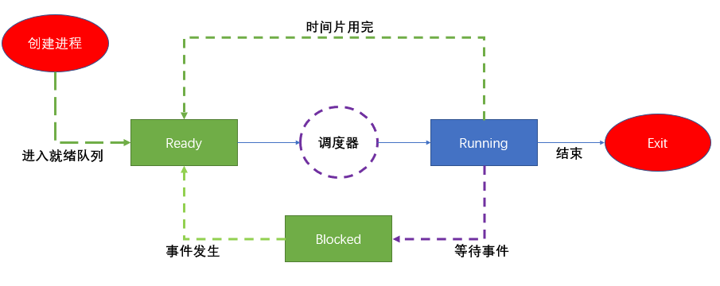

# 一 调度器
Linux内核中用来安排调度进程（某段程序的执行过程）执行的模块成为调度器（Scheduler），它可以切换进程状态（Process status）。例如：执行、可中断睡眠、不可中断睡眠、退出、暂停等。



## 1 调度器
调度器相当于CPU中央处理器的管理员，主要负责完成做两件事：
* 选择某些就绪进程来执行
* 打断某些执行的进程让它们变为就绪状态。

1.调度：就是按照某种调度的算法设计，从进程的就绪队列当中选取进程分配CPU，主要是协调对CPU等相关资源使用。进程调度目的：最大限度利用CPU时间。

2.如果调度器支持就绪状态切换到执行状态，同时支持执行状态切换到就绪状，称该调度器为抢占式调度器。

## 2 调度类 sched_class结构体
```c
// 调度类
struct sched_class {
	/* 操作系统当中有多个调度类，按照调度优先级排成一个链表 */
    const struct sched_class *next;

#ifdef CONFIG_UCLAMP_TASK
	int uclamp_enabled;
#endif
    /* 将进程加入到执行队列当中，即将调度实体（进程）存放到红黑树当中，并对nr_running变量自动加1 */
	void (*enqueue_task) (struct rq *rq, struct task_struct *p, int flags);

    /* 从执行队列中删除进程，并对nr_running变量自动减1 */
	void (*dequeue_task) (struct rq *rq, struct task_struct *p, int flags);
    /* 放弃CPU执行权限，实际上此函数执行先出队后入队，在这种情况它直接将调度实体存放在红黑树的最右端 */
	void (*yield_task)   (struct rq *rq);
    bool (*yield_to_task)(struct rq *rq, struct task_struct *p, bool preempt);

    /* 专门用于检查当前进程是否可被新进程抢占 */
	void (*check_preempt_curr)(struct rq *rq, struct task_struct *p, int flags);

    /* 选择下一个要运行的进程 */
	struct task_struct *(*pick_next_task)(struct rq *rq);

    /* 将进程拖加到运行队列当中 */
	void (*put_prev_task)(struct rq *rq, struct task_struct *p);
	void (*set_next_task)(struct rq *rq, struct task_struct *p, bool first);

#ifdef CONFIG_SMP
	int (*balance)(struct rq *rq, struct task_struct *prev, struct rq_flags *rf);

    /* 为进程选择一个合适的CPU*/
	int  (*select_task_rq)(struct task_struct *p, int task_cpu, int sd_flag, int flags);
    /* 迁移任务到另一个CPU */
	void (*migrate_task_rq)(struct task_struct *p, int new_cpu);

    /* 专门用于唤醒进程 */
	void (*task_woken)(struct rq *this_rq, struct task_struct *task);

    /* 修改进程在CPU的亲和力 */
	void (*set_cpus_allowed)(struct task_struct *p,
				 const struct cpumask *newmask);

    /* 启动/进制运行进程 */
	void (*rq_online)(struct rq *rq);
	void (*rq_offline)(struct rq *rq);
#endif

	void (*task_tick)(struct rq *rq, struct task_struct *p, int queued);
	void (*task_fork)(struct task_struct *p);
	void (*task_dead)(struct task_struct *p);

	/*
	 * The switched_from() call is allowed to drop rq->lock, therefore we
	 * cannot assume the switched_from/switched_to pair is serliazed by
	 * rq->lock. They are however serialized by p->pi_lock.
	 */
	void (*switched_from)(struct rq *this_rq, struct task_struct *task);
	void (*switched_to)  (struct rq *this_rq, struct task_struct *task);
	void (*prio_changed) (struct rq *this_rq, struct task_struct *task,
			      int oldprio);

	unsigned int (*get_rr_interval)(struct rq *rq,
					struct task_struct *task);

	void (*update_curr)(struct rq *rq);

#define TASK_SET_GROUP		0
#define TASK_MOVE_GROUP		1

#ifdef CONFIG_FAIR_GROUP_SCHED
	void (*task_change_group)(struct task_struct *p, int type);
#endif
};
```

调度器类可以分为： stop_sched_class/dl_sched_class/rt_sched_class/fair_sched_class/idle_sched_class

```c
extern const struct sched_class stop_sched_class; //停机调度类
extern const struct sched_class dl_sched_class; // 期限调度类
extern const struct sched_class rt_sched_class; // 实时调度类
extern const struct sched_class fair_sched_class; // 公平调度类
extern const struct sched_class idle_sched_class; // 空闲调度类
```
调度类优先级：从高到低  停机 > 限期 > 实时 > 公平 > 空闲

* 停机调度类：优先级最高，停机进程是优先级最高的进程，可以抢占所有其他进程，其他进程不可能抢占停机进程。
* 限期调度类：最早使用优先算法，使用红黑树把进程按照绝对截止期限从小到大排序，每次调度时选择绝对截止期限最小的进程。
* 实时调度类：为每个调度 优先级维护一个队列。
* 公平调度类：使用完全公平调度算法。完全公平调度算法引入虚拟运行时间的相关概念：虚拟运行时间 = 实际运行时间*nice0对应的权重/进程的权重。
* 空闲调度类：每个CPU上有一个空闲线程，即0号线程。空闲调度类优先级别最低，仅当没有其他进程可以调度的时候，才使用

## 3 进程优先级
task struct结构体中采用三个成员表示进程的优先级:prio和normal_prio表示动态优先级,static_prio表示进程的静态优先级。
内核将任务优先级划分，实时优先级范围是0到MAXRTPRIO-1(即99)，而普通进程
的静态优先级范围是从MAXRTPRIO到MAXPRIO-1(即100到139)。
Linux内核优先级源码如下：

```
// include>include>linux>sched>prio.h

#define MAX_USER_RT_PRIO	100
#define MAX_RT_PRIO		MAX_USER_RT_PRIO

#define MAX_PRIO		(MAX_RT_PRIO + NICE_WIDTH)
#define DEFAULT_PRIO		(MAX_RT_PRIO + NICE_WIDTH / 2)
```

进程分类
实时进程（Real-Time Process）：优先级高、需要立即被执行的进程。
普通进程（Normal Process）：优先级低、更长执行时间的进程。
进程的优先级是一个 0 ~ 139 的整数直接来表示。数字越小，优先级越高，其中优先级 0 ~ 99 留给实时进程， 100 ~ 139 留给普通进程。我们使用如下图所示：


## 4 内核调度策略


```
/*
 * Scheduling policies
 */
#define SCHED_NORMAL		0
#define SCHED_FIFO		1
#define SCHED_RR		2
#define SCHED_BATCH		3
/* SCHED_ISO: reserved but not implemented yet */
#define SCHED_IDLE		5
#define SCHED_DEADLINE		6
```
* SCHED_NORMAL: 	普通进程调度策略，是task选择CFS调度器来调度运行；
* SCHED_FIFO:		实时进程调度策略，先进先出调度，没有时间片，没有更高优先级的装塔下，只有等待主动让出CPU；
* SCHED_RR：		实时进程调度策略，时间片轮转，进程使用完时间片之后加入优先级对应运行队列当中的尾部，把CPU让给同等优先级的其他进程。
* SCHED_BATCH：	普通进程调度策略，批量处理，使task选择CFS调度器来调度运行；
* SCHED_IDLE：	普通进程调度策略，使task以最低优先级选择CFS调度器来调度运行；
* SCHED_DEADLINE：限期进程调度策略，使task选择Dealline调度器来调度运行；
ps：其中stop调度器和deadline调度器，仅使用于内核，用户没有办法选择

# 二 CFS调度器
> 完全公平调度算法体现在对待每个进程都是公平的，让每个进程都运行一段相同的时间片
这就是基于时间片轮询调度算法。
CFS定义一种新调度模型，它给cfs rq(cfs的run queue)中的每一个进程都设置一个虚
拟时钟-virtual runtime(vruntime)。如果一个进程得以执行，随着执行时间的不断增长，其vruntime也将不断增大，没有得到执行的进程vruntime将保持不变。

* 备注:进程描述符task_struct结构中，有几个成员与调度相关，具体成员:prio、
normal_prio、static_prio、rt_priority等。

## 实际运行时间
CFS（Complete Fair Scheduler, 完全公平调度器）在实际当中必须会有进程优先级高或者进程优先级低，CFS调度器引入权重，使用权重代表进程的优先级，各个进程按照权重比例分配CPU时间。

假设有2个进程 X 和 Y， X权重1024，B权重2048。
A获得CPU时间比例为：1024/(1024+2048) = 33.3%
B获得CPU时间比例为：2048/(1024_2048) = 66.6%

在引入权重之后分配给进程的时间计算公式如下：
实际运行时间 = 调度周期 * 进程权重 / 所有权重和

## 虚拟运行时间
虚拟运行时间 = 实际运行时间 * NICE_0_LOAD / 进程权重 = (调度周期 * 进程权重 / 所有进程权重之和) * NICE_0_LOAD / 进程权重 = 调度周期 * 1024 / 所有进程权重和

在一个调度周期里面，所有进程的虚拟运行时间是相同的，所以在进程调度时，只需要找到虚拟运行时间的最小进程调度运行即可。

## 调度子系统各个组件模块
调度器通过各个组件模块及一系列数据结构，来排序和管理系统中的进程，他们的关系如下


* 主调度器：通过调用schedule()函数来完成进程的选择和切换。
* 周期性调度器：根据频率自动调用scheduler_tick函数，作用根据进程运行时间触发调度。
* 上下文切换：主要做两个事情（切换地址空间、切换寄存器和栈空间）。

## CFS调度器类
CFS调度器类为fair_sched_class，CFS调度器和一些特定的函数关联起来，具体源码如下：

```

/*
 * All the scheduling class methods:
 */
const struct sched_class fair_sched_class = {
	.next			= &idle_sched_class,  // 空闲调度类
	.enqueue_task		= enqueue_task_fair,	// 当任务进入可运行状态时，用此函数将调度实体存放到红黑树，完成入队操作。
	.dequeue_task		= dequeue_task_fair,	// 当任务退出可运行状态，做出队操作。
	.yield_task		= yield_task_fair,
	.yield_to_task		= yield_to_task_fair,

	.check_preempt_curr	= check_preempt_wakeup,

	.pick_next_task		= __pick_next_task_fair,
	.put_prev_task		= put_prev_task_fair,
	.set_next_task          = set_next_task_fair,
```

## CFS调度器就绪队列

调度管理

```
// kernel/sched/sched.h
/* CFS-related fields in a runqueue */
struct cfs_rq {
	struct load_weight	load;
	unsigned long		runnable_weight;
	unsigned int		nr_running;
	unsigned int		h_nr_running;      /* SCHED_{NORMAL,BATCH,IDLE} */
	unsigned int		idle_h_nr_running; /* SCHED_IDLE */

	u64			exec_clock;
	u64			min_vruntime;
#ifndef CONFIG_64BIT
	u64			min_vruntime_copy;
	
	struct rb_root_cached	tasks_timeline;		

	/*
	 * 'curr' points to currently running entity on this cfs_rq.
	 * It is set to NULL otherwise (i.e when none are currently running).
	 */
	// sched_entity 可被内核调度的实体
	struct sched_entity	*curr;
	struct sched_entity	*next;
	struct sched_entity	*last;
	struct sched_entity	*skip;

#endif
```

cfs_rq : 跟踪就绪队列信息及管理就绪态调度实体，并维护一查按照虚拟时间排序的红黑树。
tasks_timeline->rb_root : // 红黑树的根