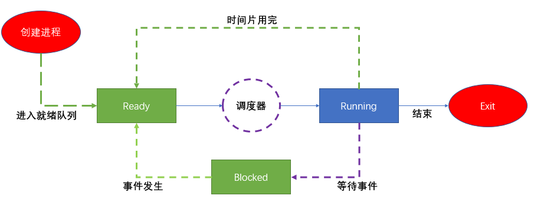

# 调度器
Linux内核中用来安排调度进程（某段程序的执行过程）执行的模块成为调度器（Scheduler），它可以切换进程状态（Process status）。例如：执行、可中断睡眠、不可中断睡眠、退出、暂停等。



## 调度器
调度器相当于CPU中央处理器的管理员，主要负责完成做两件事：
* 选择某些就绪进程来执行
* 打断某些执行的进程让它们变为就绪状态。

1.调度：就是按照某种调度的算法设计，从进程的就绪队列当中选取进程分配CPU，主要是协调对CPU等相关资源使用。进程调度目的：最大限度利用CPU时间。

2.如果调度器支持就绪状态切换到执行状态，同时支持执行状态切换到就绪状，称该调度器为抢占式调度器。

## 调度类 sched_class结构体
```c
// 调度类
struct sched_class {
	/* 操作系统当中有多个调度类，按照调度优先级排成一个链表 */
    const struct sched_class *next;

#ifdef CONFIG_UCLAMP_TASK
	int uclamp_enabled;
#endif
    /* 将进程加入到执行队列当中，即将调度实体（进程）存放到红黑树当中，并对nr_running变量自动加1 */
	void (*enqueue_task) (struct rq *rq, struct task_struct *p, int flags);

    /* 从执行队列中删除进程，并对nr_running变量自动减1 */
	void (*dequeue_task) (struct rq *rq, struct task_struct *p, int flags);
    /* 放弃CPU执行权限，实际上此函数执行先出队后入队，在这种情况它直接将调度实体存放在红黑树的最右端 */
	void (*yield_task)   (struct rq *rq);
    bool (*yield_to_task)(struct rq *rq, struct task_struct *p, bool preempt);

    /* 专门用于检查当前进程是否可被新进程抢占 */
	void (*check_preempt_curr)(struct rq *rq, struct task_struct *p, int flags);

    /* 选择下一个要运行的进程 */
	struct task_struct *(*pick_next_task)(struct rq *rq);

    /* 将进程拖加到运行队列当中 */
	void (*put_prev_task)(struct rq *rq, struct task_struct *p);
	void (*set_next_task)(struct rq *rq, struct task_struct *p, bool first);

#ifdef CONFIG_SMP
	int (*balance)(struct rq *rq, struct task_struct *prev, struct rq_flags *rf);

    /* 为进程选择一个合适的CPU*/
	int  (*select_task_rq)(struct task_struct *p, int task_cpu, int sd_flag, int flags);
    /* 迁移任务到另一个CPU */
	void (*migrate_task_rq)(struct task_struct *p, int new_cpu);

    /* 专门用于唤醒进程 */
	void (*task_woken)(struct rq *this_rq, struct task_struct *task);

    /* 修改进程在CPU的亲和力 */
	void (*set_cpus_allowed)(struct task_struct *p,
				 const struct cpumask *newmask);

    /* 启动/进制运行进程 */
	void (*rq_online)(struct rq *rq);
	void (*rq_offline)(struct rq *rq);
#endif

	void (*task_tick)(struct rq *rq, struct task_struct *p, int queued);
	void (*task_fork)(struct task_struct *p);
	void (*task_dead)(struct task_struct *p);

	/*
	 * The switched_from() call is allowed to drop rq->lock, therefore we
	 * cannot assume the switched_from/switched_to pair is serliazed by
	 * rq->lock. They are however serialized by p->pi_lock.
	 */
	void (*switched_from)(struct rq *this_rq, struct task_struct *task);
	void (*switched_to)  (struct rq *this_rq, struct task_struct *task);
	void (*prio_changed) (struct rq *this_rq, struct task_struct *task,
			      int oldprio);

	unsigned int (*get_rr_interval)(struct rq *rq,
					struct task_struct *task);

	void (*update_curr)(struct rq *rq);

#define TASK_SET_GROUP		0
#define TASK_MOVE_GROUP		1

#ifdef CONFIG_FAIR_GROUP_SCHED
	void (*task_change_group)(struct task_struct *p, int type);
#endif
};
```

调度器类可以分为： stop_sched_class/dl_sched_class/rt_sched_class/fair_sched_class/idle_sched_class

```c
extern const struct sched_class stop_sched_class; //停机调度类
extern const struct sched_class dl_sched_class; // 期限调度类
extern const struct sched_class rt_sched_class; // 实时调度类
extern const struct sched_class fair_sched_class; // 公平调度类
extern const struct sched_class idle_sched_class; // 空闲调度类
```
调度类优先级：从高到低  停机 > 限期 > 实时 > 公平 > 空闲

* 停机调度类：优先级最高，停机进程是优先级最高的进程，可以抢占所有其他进程，其他进程不可能抢占停机进程。
* 限期调度类：最早使用优先算法，使用红黑树把进程按照绝对截止期限从小到大排序，每次调度时选择绝对截止期限最小的进程。
* 实时调度类：为每个调度 优先级维护一个队列。
* 公平调度类：使用完全公平调度算法。完全公平调度算法引入虚拟运行时间的相关概念：虚拟运行时间 = 实际运行时间*nice0对应的权重/进程的权重。
* 空闲调度类：每个CPU上有一个空闲线程，即0号线程。空闲调度类优先级别最低，仅当没有其他进程可以调度的时候，才使用

## 优先级
task struct结构体中采用三个成员表示进程的优先级:prio和normal_prio表示动态优先级,static_prio表示进程的静态优先级。
内核将任务优先级划分，实时优先级范围是0到MAXRTPRIO-1(即99)，而普通进程
的静态优先级范围是从MAXRTPRIO到MAXPRIO-1(即100到139)。
Linux内核优先级源码如下：

# CFS调度器