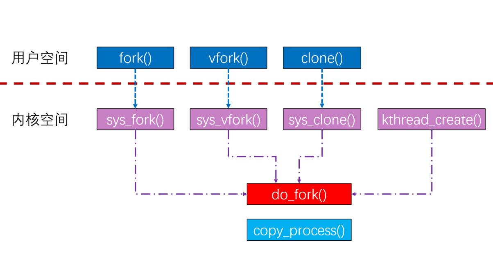

# 进程原理
## 一 进程/进程生命周期 {#1}
### 1.1 进程
操作系统作为硬件的使用层，提供使用硬件资源的能力，进程作为操作系统使用层，提供使用操作系统抽象出的资源层的能力。

进程：是指计算机中已运行的程序。进程本身不是基本的运行单位，而是线程的容器，程序本身只是指令、数据及其组织形式的描述，进程才是程序的真正运行实例。

Linux内核吧进程叫做任务（task），进程的虚拟地址空间可分为用户虚拟地址空间和内核虚拟地址空间，所有进程共享内核虚拟地址空间，每个进程有独立的用户虚拟地址空间。

进程有两种特殊的形式：没有用户虚拟地址的进程叫内核线程，共享用户虚拟地址空间的进程叫做用户线程。共享同一个用户虚拟地址空间的所有用户教程叫做线程组。

|描述			| 		实质|
|:-------------|:-----------|
|C语言标准库进程   |       Linux内核进程
|包括多个线程的进程 |     线程组|
|只有一个线程的进程 |    任务或进程|
|线程              |  共享用户虚拟地址空间的进程|

#### Linux查看进程状态
>PS命令，显示瞬间进程的状态，并不是动态连续。
```

```

>top命令，可以动态监控进程实时状态。


### 1.2 进程生命周期

Linux操作系统属于多任务操作系统，系统中的每个进程能够分时**复用CPU时间片**，通过有效的进程调度策略实现多任务并行执行。而进程在被CPU调度运行，等待CPU资源分配以及等待外部事件时会属于不同的状态。进程状态如下：
- 创建状态：创建新进程；
- 就绪状态：进程获取可以运作所有资源及准备相关条件；
- 执行状态：进程正在CPU中执行操作；
- 阻塞状态：进程因等待某些资源而被跳出CPU；
- 终止状态：进程消亡。

>Linux内核提供API函数来设置进程的状态
>>```
>>TASK_RUNNING（可运行状态或者可就绪状态）；
>>TASK_INTERRUPTIBLE（可中断睡眠状态，又叫浅睡眠状态）；
>>TASK_UNINTERRUPTIBLE（不可中断状态，又叫深睡眠状态）；可以通过PS命令查看状态D的进程
>>__TASK_STOPPED（终止状态）；
>>EXIT_ZOMBIE（僵尸状态）；
>>```

## 1.3 task_struct数据结构分析

进程是操作系统调度的一个实体，需要对进程所必须资源做一个抽象化，此抽象化为进程控制块(PCB，Process Control Block)，在Linux内核里面采用task_struct结构体来描述专程控制块。Linux内核涉及进程和程序的所有算法都围绕名为task_struct的数据结构而建立操作。**具体Linux内核源码task_struct结构体核心成员如下:**

**Linux内核进程描述符task_struct数据结构，源码分析如下**
**task内核源码**
```c
struct task_struct {

	/* -1 unrunnable, 0 runnable, >0 stopped: */
	volatile long			state;  // 进程的状态


	void				*stack;		// 指向内核栈
	refcount_t			usage;
	/* Per task flags (PF_*), defined further below: */
	unsigned int			flags;
	unsigned int			ptrace;


    /* 进程调度策略和优先级 */
	int				prio;
	int				static_prio;
	int				normal_prio;
	unsigned int			rt_priority;

	const struct sched_class	*sched_class;  //表示该进程所属的调度器类
	struct sched_entity		se;
	struct sched_rt_entity		rt;
#ifdef CONFIG_CGROUP_SCHED
	struct task_group		*sched_task_group;
#endif
	struct sched_dl_entity		dl;


	unsigned int			policy;
	int				nr_cpus_allowed;
	const cpumask_t			*cpus_ptr;  //此成员允许进程在哪个CPU上运行
	cpumask_t			cpus_mask;

    // 这两个指针指向内存描述符，mm和active_mm指向同一个内存描述符,内核线程mm就是空指针，但是
	// 当内核线程运行是，active_mm指向从进程借用内存描述符
	struct mm_struct		*mm;
	struct mm_struct		*active_mm;

	pid_t				pid;    // 全局进程号
	pid_t				tgid;   // 全局线程组标识符

	/* Real parent process: */
	struct task_struct __rcu	*real_parent;   // 指向真实的父进程

	/* Recipient of SIGCHLD, wait4() reports: */
	struct task_struct __rcu	*parent;		// 指向父进程

	/*
	 * Children/sibling form the list of natural children:
	 */
	struct list_head		children;
	struct list_head		sibling;
	struct task_struct		*group_leader;   //指向线程组的组长

	/* PID/PID hash table linkage. */
	struct pid			*thread_pid;
	struct hlist_node		pid_links[PIDTYPE_MAX];  //进程号，进程组标识符和会话标识符
	struct list_head		thread_group;
	struct list_head		thread_node;


	/* Objective and real subjective task credentials (COW): */
	const struct cred __rcu		*real_cred;   //此成员指向主体和真实客体证书

	/* Effective (overridable) subjective task credentials (COW): */
	const struct cred __rcu		*cred;		// 指向有效客体证书，可以临时改变


	/*
	 * executable name, excluding path.
	 *
	 * - normally initialized setup_new_exec()
	 * - access it with [gs]et_task_comm()
	 * - lock it with task_lock()
	 */
	char				comm[TASK_COMM_LEN];        //进程名称

	struct nameidata		*nameidata;

	/* 以下两个用于信号量和共享内存 */
#ifdef CONFIG_SYSVIPC
	struct sysv_sem			sysvsem;  	
	struct sysv_shm			sysvshm;
#endif
#ifdef CONFIG_DETECT_HUNG_TASK
	unsigned long			last_switch_count;
	unsigned long			last_switch_time;
#endif
	/* Filesystem information: */
	struct fs_struct		*fs;    //此成员文件系统信息，主要是进程的根目录和当前工作目录

	/* Open file information: */
	struct files_struct		*files;     //打开文件表

	/* Namespaces: */
	struct nsproxy			*nsproxy;   //命名空间

	// 用于信号处理
	/* Signal handlers: */
	struct signal_struct		*signal;
	struct sighand_struct __rcu		*sighand;
	sigset_t			blocked;
	sigset_t			real_blocked;
	/* Restored if set_restore_sigmask() was used: */
	sigset_t			saved_sigmask;
	struct sigpending		pending;
	unsigned long			sas_ss_sp;
	size_t				sas_ss_size;
	unsigned int			sas_ss_flags;

	struct callback_head		*task_works;


};
```

# 二 进程优先级/系统调用
### 2.1 进程优先级
限期进程的优先级比实时进程要高，实时进程的优先级比普通进程要高、
* 限期进程的优先级是-1;
* 实时进程的优先级1-99，优先级数值最大，表示优先级越高,
* 普通进程的静态优先级为:100-139，优先级数值越小，表示优先级越高，可通过修改nice值改变普通进程的优先级，优先级等于120加上nice值
```c
/* 进程优先级 */
//include/linux/sched.h>task_struct>prio
int         prio;			// 动态优先级
int         static_prio;	// 静态优先级
int         normal_prio;	// 普通进程优先级
unsigned int    rt_priority;	//实时优先级
```

> 限期进程：
> 实时进程：
> 普通进程：

进程优先级如下

|优先级|限期进程|实时进程 | 普通进程 |
|------|-------| ------ | ------- |
|prio调度优先级（数值越小，优先级越高）|大多数情况下proi等于normal_prio。特殊情况：如果进程X占有实时互斥锁，进程Y正在等待锁，进程Y的优先级比进程X优先级高，那么吧进程X的优先级临时提高到进程Y的优先级，即进程X的prio的值等于进程Y的prio值。| 
|static_prio静态优先级| 没有意义，总是0 | 没有意义，总是0 | 120+nice值，数值越小，表示优先级越高 |
|normal_prio正常优先级(数值越小优先级越高) | -1 | 99-rt_priority | static_prio |
|rt_priority实时优先级 | 没有意义，总是0 | 实时进程的优先级，范围1-99，数值越大优先级越高 | 没有意义，总是0 |


## 2.2 系统调用

> 当运行应用程序的时候，调用fork()/vfork()/clone()函数就是系统调用。系统调用就是应用程序如何进入内核空间执行任务，程序使用系统调用执行一系列的操作:比如创建进程、文件IO等等。具体如下图所示:

]


```c

// fork
#ifdef __ARCH_WANT_SYS_FORK
SYSCALL_DEFINE0(fork)
{
#ifdef CONFIG_MMU
	struct kernel_clone_args args = {
		.exit_signal = SIGCHLD,
	};

	return _do_fork(&args);
#else
	/* can not support in nommu mode */
	return -EINVAL;
#endif
}
#endif

// vfork
#ifdef __ARCH_WANT_SYS_VFORK
SYSCALL_DEFINE0(vfork)
{
	struct kernel_clone_args args = {
		.flags		= CLONE_VFORK | CLONE_VM,
		.exit_signal	= SIGCHLD,
	};

	return _do_fork(&args);
}
#endif

//  clone
SYSCALL_DEFINE5(clone, unsigned long, clone_flags, unsigned long, newsp,
		 int __user *, parent_tidptr,
		 int __user *, child_tidptr,
		 unsigned long, tls)
#endif
{
	struct kernel_clone_args args = {
		.flags		= (lower_32_bits(clone_flags) & ~CSIGNAL),
		.pidfd		= parent_tidptr,
		.child_tid	= child_tidptr,
		.parent_tid	= parent_tidptr,
		.exit_signal	= (lower_32_bits(clone_flags) & CSIGNAL),
		.stack		= newsp,
		.tls		= tls,
	};

	if (!legacy_clone_args_valid(&args))
		return -EINVAL;

	return _do_fork(&args);
}

// do_fork
long do_fork(unsigned long clone_flags,  //创建进程标志位集合
	      unsigned long stack_start,	// 用户态栈的起始位置
	      unsigned long stack_size,		// 用户态栈的大小，一般情况下设置为0
	      int __user *parent_tidptr,	// 指向用户空间中地址的指针，分配指向父子进程的PID
	      int __user *child_tidptr)
{
	struct kernel_clone_args args = {
		.flags		= (lower_32_bits(clone_flags) & ~CSIGNAL),
		.pidfd		= parent_tidptr,
		.child_tid	= child_tidptr,
		.parent_tid	= parent_tidptr,
		.exit_signal	= (lower_32_bits(clone_flags) & CSIGNAL),
		.stack		= stack_start,
		.stack_size	= stack_size,
	};

	if (!legacy_clone_args_valid(&args))
		return -EINVAL;

	return _do_fork(&args);
}

// _do_fork
long _do_fork(struct kernel_clone_args *args)
{
	u64 clone_flags = args->flags;
	struct completion vfork;
	struct pid *pid;
	struct task_struct *p;
	int trace = 0;
	long nr;

	/*
	 * Determine whether and which event to report to ptracer.  When
	 * called from kernel_thread or CLONE_UNTRACED is explicitly
	 * requested, no event is reported; otherwise, report if the event
	 * for the type of forking is enabled.
	 */
	if (!(clone_flags & CLONE_UNTRACED)) {
		if (clone_flags & CLONE_VFORK)
			trace = PTRACE_EVENT_VFORK;
		else if (args->exit_signal != SIGCHLD)
			trace = PTRACE_EVENT_CLONE;
		else
			trace = PTRACE_EVENT_FORK;

		if (likely(!ptrace_event_enabled(current, trace)))
			trace = 0;
	}

	p = copy_process(NULL, trace, NUMA_NO_NODE, args);
	add_latent_entropy();

	if (IS_ERR(p))
		return PTR_ERR(p);

	/*
	 * Do this prior waking up the new thread - the thread pointer
	 * might get invalid after that point, if the thread exits quickly.
	 */
	trace_sched_process_fork(current, p);

	pid = get_task_pid(p, PIDTYPE_PID);
	nr = pid_vnr(pid);

	if (clone_flags & CLONE_PARENT_SETTID)
		put_user(nr, args->parent_tid);

	if (clone_flags & CLONE_VFORK) {
		p->vfork_done = &vfork;
		init_completion(&vfork);
		get_task_struct(p);
	}

	wake_up_new_task(p);

	/* forking complete and child started to run, tell ptracer */
	if (unlikely(trace))
		ptrace_event_pid(trace, pid);

	if (clone_flags & CLONE_VFORK) {
		if (!wait_for_vfork_done(p, &vfork))
			ptrace_event_pid(PTRACE_EVENT_VFORK_DONE, pid);
	}

	put_pid(pid);
	return nr;
}
#endif
```

## 三 内核线程
> 内核线程是直接由内核本身启动的进程。内核线程实际上是将内核函数委托给独立的进程
与系统中其他进程“并行”执行(实际上，也并行于内核自身的执行)。内核线程经常称之为
(内核)守护进程。它们用于执行下列任务。
* 周期性地将修改的内存页与页来源块设备同步(例如，使用mmap的文件映射);
* 如果内存页很少使用，则写入交换区;
* 管理延时动作(deferred action);
* 实现文件系统的事务日志。

它是独立运行在内核空间的进程，与普通用户进程区别在于内核线程没有独立的进程地址空间。task_struct数据结构里面有一个成员指针mm设置为NULL，它只能运行在内核空间。

```c
/*
 * Create a kernel thread.
 */
pid_t kernel_thread(int (*fn)(void *), void *arg, unsigned long flags)
{
	struct kernel_clone_args args = {
		.flags		= ((lower_32_bits(flags) | CLONE_VM |
				    CLONE_UNTRACED) & ~CSIGNAL),
		.exit_signal	= (lower_32_bits(flags) & CSIGNAL),
		.stack		= (unsigned long)fn,
		.stack_size	= (unsigned long)arg,
	};

	return _do_fork(&args);
}
```

## 3.1 退出进程
> 退出进程有两种方式：一种是调用exit()系统调用或从某个程序主函数返回；另一个方式为被接收到杀死信号或者异常时地被终止。

* 进程主动终止：从main()函数返回，链接程序会自动添加到exit()系统调用；主动调用exit()系统函数。
* 进程被动终止：进程收到一个自己不能处理的信号；进程收到 SIGKILL 等终止信息.

```c
SYSCALL_DEFINE1(exit, int, error_code)
{
	do_exit((error_code&0xff)<<8);
}
```