# 一、启动与初始化类问题

1. **上电不启动、黑屏、无串口输出**

   - 电源不稳、复位电路异常、看门狗一直复位
   - Flash / 启动介质损坏、启动头（bootloader）损坏
   - DDR 初始化失败、时钟配置错误

   

2. **启动卡死在早期阶段**

   - 时钟树配置错误导致外设不工作
   - DDR 训练失败、内存访问越界
   - 中断向量表错误、异常处理未初始化

   

3. **Bootloader 与 Kernel / 应用不兼容**

   - 设备树不对、分区表错乱
   - 加载地址、入口地址不匹配

   

# 二、内存与地址空间问题

1. **内存泄漏**

   - 长期运行后 OOM、进程被杀、系统卡顿

   

2. **栈溢出 / 栈破坏**

   - 局部变量过大、递归过深
   - 函数调用层级太深，踩坏上下文

   

3. **堆越界、野指针、空指针**

   - 踩内存导致随机死机、数据异常

   

4. **非对齐访问**

   - ARM 等架构对地址对齐严格，直接触发异常

   

5. **MMU / 缓存一致性问题**

   - Cache 没刷导致 DMA 数据不对
   - 外设寄存器访问没设强序、设备内存属性

   

# 三、电源、时钟、复位问题

1. **电源域切换异常、掉电唤醒失败**

2. **时钟频率配置错误**

   - 外设时钟不对导致波特率、采样率异常

   

3. **看门狗频繁复位**

   - 任务阻塞、死循环、中断关太久

   

4. **低功耗模式下死机 / 唤醒异常**

   - 时钟未恢复、外设未重新初始化

   

# 四、中断与调度系统级问题

1. **中断风暴 / 中断死循环**

2. **中断优先级配置错误**

   - 高优先级中断抢占关键操作

   

3. **关中断太久导致系统调度异常、时序崩坏**

4. **软中断 /tasklet 卡死内核**

5. **调度器异常：任务饥饿、优先级反转**

6. **死锁（mutex、信号量、自旋锁）**

# 五、驱动与外设交互问题

1. **驱动与硬件寄存器配置不匹配**
2. **DMA 异常、数据丢失、地址错误**
3. **I2C/SPI/UART 通讯不稳定、丢包、噪声**
4. **PHY / 网口 / Flash 等外设识别失败**
5. **设备树（DTS）配置错误导致驱动不加载**
6. **热插拔、插拔外设时系统崩溃**

# 六、文件系统与存储问题

1. **Flash 坏块、磨损不均衡导致掉电丢数据**
2. **文件系统损坏（jffs2/ubifs/ext4 异常）**
3. **掉电未同步导致分区只读、无法挂载**
4. **读写速度慢、IO 阻塞卡死应用**

# 七、网络与通信系统级问题

1. **网络协议栈卡死、丢包、重传风暴**
2. **Socket 资源泄漏、端口耗尽**
3. **MAC/PHY 链路频繁 UP/DOWN**
4. **网络时间不同步导致业务逻辑错乱**
5. **多核网络收发包并发竞争**

# 八、多核与并发问题

1. **多核竞态条件（race condition）**
2. **自旋锁死锁、原子操作缺失**
3. **CPU 间中断（IPI）异常**
4. **共享内存数据不一致**

# 九、稳定性与长期运行问题

1. **长时间运行死机、重启、莫名异常**
2. **温度升高后稳定性下降**
3. **电磁干扰导致系统跑飞**
4. **时序敏感业务偶现错误（难复现）**

# 十、性能与实时性问题

1. **调度延迟大，实时任务不实时**
2. **中断处理太慢导致丢数据**
3. **CPU 占用率 100%、软中断占用过高**
4. **总线带宽不足、多外设并发瓶颈**

# 十一、安全与权限类系统问题

1. **TrustZone / 安全启动配置错误**
2. **权限越界、非法访问敏感区域**
3. **密钥、分区加密异常导致无法启动**


# 案例一：网管口上下电概率无法up


现象：某marvell交换机

分析：属于上下电时序 + phy初始化系统级问题，应该是硬件上电时序和驱动初始化时机不对

网管口有了两套SMI总线访问机制

网管口接口

```mermaid
flowchart TD
  subgraph PHY 读取通道1
   	Is1512/OpenMmio/Dump --> 
	phyreadA1["DRV_MENET_PHY_Read"] -->
	phyreadA2["Drv_Bsp_MASTER_SMI_Read"]
  end
  subgraph PHY 读取通道2
	各类phy操作 -->
	phyreadB1["DRV_SYSM_MvPhy_read"] -->
    phyreadB2["DRV_SYSM_MvPhy_bsp_read"] -->
	phyreadB3["DRV_SYSM_PhyIoctl_Read"] -->
    phyreadB4["socket"]
  end
  
  subgraph PHY 操作3-调试通道
    DRV_SYSM_DumpCallBack(DRV_DUMP_SYSM_CMT_PHY) -->
  	DRV_SYSM_PhyReadCmd -->
  	DRV_MENET_PHY_READ_WITH_PAGE
  end
```

- 问题

```c
DRV_MENET_PHY_SEM //设置为0
    
MEPHY_LOCK //空实现
    
DRV_SYSM_PHY_SEM // 设置为0
#define DRV_SYSM_SEM_TAKE (VOID)pthread_mutex_lock(&g_DrvSysmPhySemID)
```


# 案例二：装备版本写电子标签概率不成功


现象：用FT版本给交换机写电子标签，概率无法写入成功，flash write无报错。


# 案例三：交换机上电，phy已UP，mac侧无法up

使用88E1543芯片搭建光口，单板调试完成之后发现端口无法正常up，这个问题主要涉及到时钟问题和网络驱动部分。

 

## 24E4P单板适配进展说明

## PHY

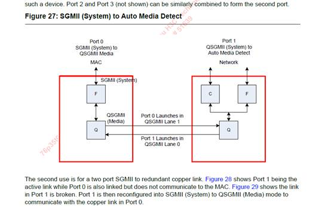

 

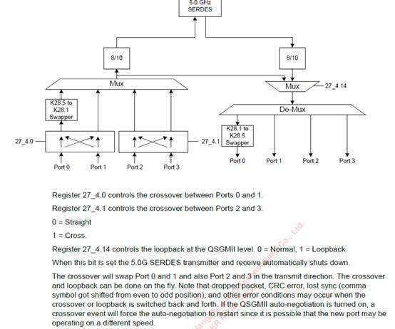

### 方案确认

目前现象：1543phy的联通是通过两个SGMII出了同一个端口，port0、port1是一组，port2、port3是一组，其中27_4.0_1是确认模式的，此方案应为cross模式。

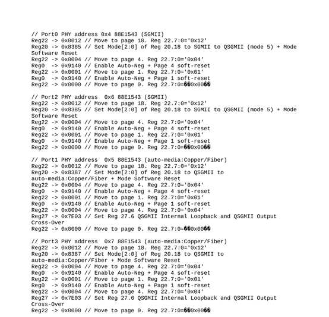

### line侧

状态：已经OK，寄存器与商业相同且都可以up

两个SGMII联通，模式cross，模式应设在port0，有mrvl脚本确认

 

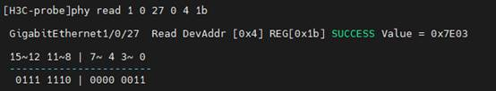

Fiber侧和QSGMII侧OK

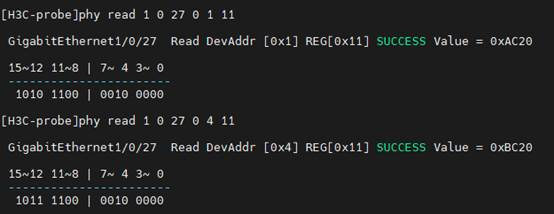

 

#### 配置确认

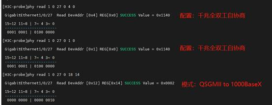

### 系统侧

配置确认：结合脚本和AC3代码来看，系统侧只在开机时对模式进行设置即可。

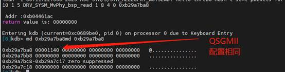

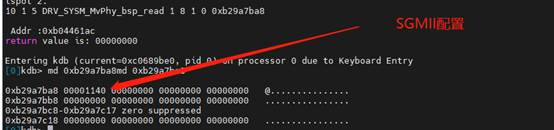

 

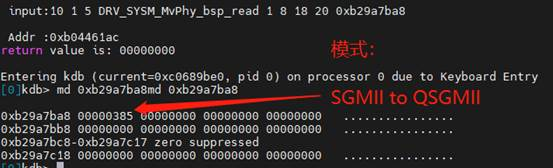

 

现象：

QSGMII侧同样up

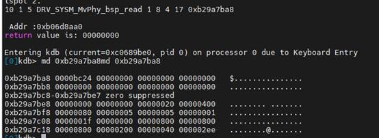

####  对比结果

商业设备：SGMII侧up，控制寄存器相同

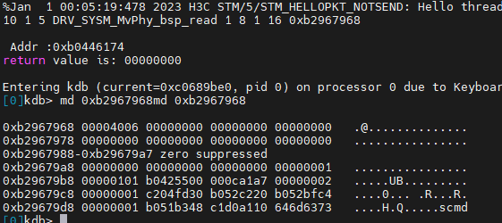

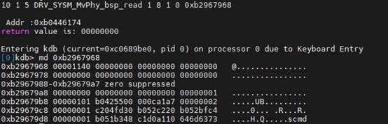

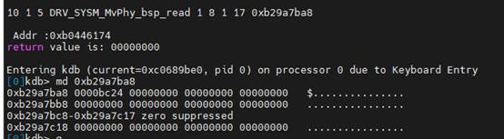

工业设备：SGMII不up，配置寄存器与商业相同

 

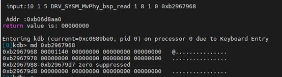

 

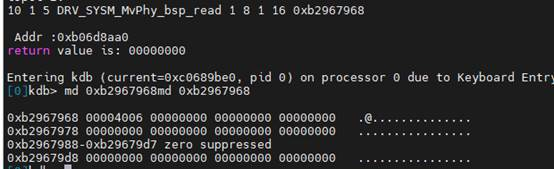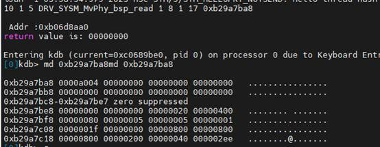

按照AC5原有代码，不进行模式设置，模式也是正确的（101：SGMII to QSGMII）

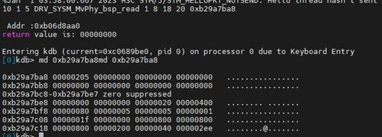

## MAC

### 注册端口信息

---------------------PORT MANGER---PARAMS----INFO-----------------------

 portType: REGULAR MODE

 ifmode : CPSS_PORT_INTERFACE_MODE_SGMII_E,

 speed : SPEED_1000_E,

 trainMode : SERDES_AUTO_TUNE_MODE_RX_TRAINING_VSR_E,

 UnmaskEventTypeList : CPSS_PORT_MANAGER_UNMASK_MAC_LOW_LEVEL_EVENTS_ENABLE_MODE_E,

 fecmode : FEC_MODE_DISABLED_E 

### MAC侧配置确认

[‎2024/‎12/‎6 10:47] mayalong ys45909 (CW, CTPL): 

mac都没有UP，哪里有speed

[‎2024/‎12/‎6 10:48] mayalong ys45909 (CW, CTPL): 

macUP才有速率

[‎2024/‎12/‎6 11:11] 

没有初始速率啥的么

[‎2024/‎12/‎6 11:11] 

就像phy那样的配置

还有双工协商啥的

[‎2024/‎12/‎6 13:57] mayalong ys45909 (CW, CTPL): 

没有

[‎2024/‎12/‎6 13:58] 

OK

 

###  端口对应关系

根据原理图

LANE6对应PHY0x8/0x9地址出的端口

LANE7对应PHY0xa/0xb地址出的端口。

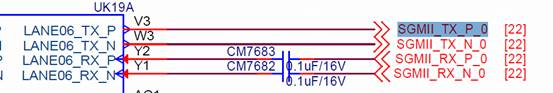

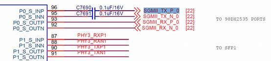

代码对应如下：

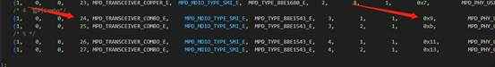

### 疑问结果

工业设备没有up起来，但是获取的速率双工均已改变。根据驱动平台的说法，是否证明已经协商过速率双工了。具体结果还在咨询FAE中。

 

商业设备

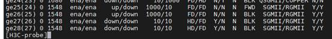

工业设备

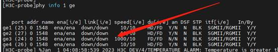

### 硬件测量

已经测量MAC和PHY之间的信号，PHY向MAC发送的是508mV左右的电压，测量MAC旁的电容

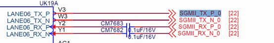

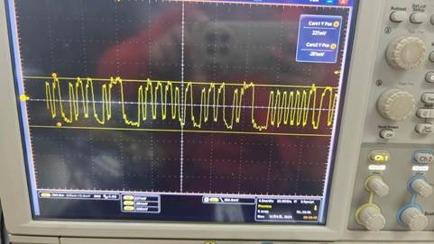

 

 

MAC向PHY发送的电压略有差异，测量PHY旁边的电容。商业设备是1.24V左右电压，工业设备是1.148

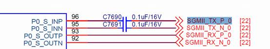

工业：1.148V

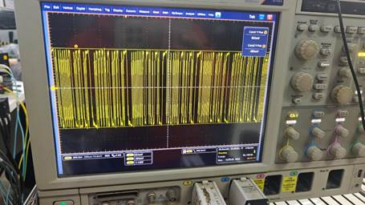

商业：1.228V

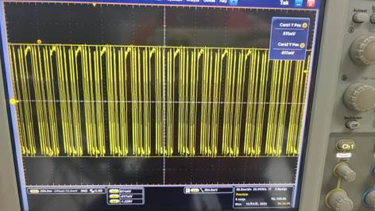

 

 

后续定位情况：

Phy的时钟选择是125Mhz，但是硬件拉的模式是25Mhz的，因此时钟无法匹配，更换25Mhz的时钟或者把模式换成125Mhz是OK的。

为什么没有第一时间怀疑时钟问题，因为phy侧是up了，如果说时钟不正确，理论上线侧应该无法up，因此把这个略过去了


# 案例四：上下电丢包


# 案例五：产品启动时间优化

IE4500 TSN设备启动时间约10分42秒，较长，根据市场需求，需要优化


#### 分析

* 是否和CPU相关？ —— 对于同ARM-v8.2 Cortes-A55设备，不存在启动时间慢问题。
* 研究哪个进程启动较慢
* 为共性问题还是单款设备问题 —— 涉及所有款型，为共性问题。
* 是否有三方工具去分析设备启动
* 是否是进程定制较多导致的问题？ —— 与AC5X对比，仅有一处不同，删除定制缩短10s，无明显变化


# 案例六：内存泄漏问题

## 现象

为拷机环境，

1. 将交换机的MQC打开，镜像到CPU；

2. 打开驱动调试开关把CPU弄高；

3. 两个telnet反复收集诊断信息；

4. 流量持续打，端口按照mac反复增删；

最后两天时间memery的freeRatio从40%掉到27%，并过一段时间重启了，IRF的备板重启。


```
dis memory
<H3C>DIS memory                                                                 
Memory statistics are measured in KB:                                           
Slot 2:                                                                         
             Total      Used      Free    Shared   Buffers    Cached   FreeRatio
Mem:       3966200   2891236   1074964         0     36520    754132       27.1%//////差不多两天多从40%左右降到目前27%
-/+ Buffers/Cache:   2100584   1865616
Swap:            0         0         0                                          
                                                                                
Slot 9:                                                                         
             Total      Used      Free    Shared   Buffers    Cached   FreeRatio
Mem:       3966200   3017552    948648         0     90740   1301308       35.1%
-/+ Buffers/Cache:   1625504   2340696                                          
Swap:            0         0         0

Container memory statistics are measured in KB:                                 
Slot 9:                                                                         
             Total      Used      Free  UsageRatio                              
Mem:       3966200   2249120    944856       56.7%                              
                                                                                
<H3C>dis irf                                                                    
MemberID    Role    Priority  CPU-Mac         Description                       
   2        Standby 1         00e0-fc0f-8c03  ---                               
 *+9        Master  1         00e0-fc0f-8c0a  ---                               
--------------------------------------------------                              
 * indicates the device is the master.
 + indicates the device through which the user logs in.                         
                                                                                
 The bridge MAC of the IRF is: f010-90db-7400                                   
 Auto upgrade                : yes                                              
 Mac persistent              : 6 min                                            
 Domain ID                   : 0                                                
 Auto merge
```

## 定位

其实查看内存使用情况，发现drvuserd是使用最多的，我们最初的怀疑方向还是驱动调试开关，这个会一直打印，因此有这样的怀疑。

进程的用户虚拟地址空间包含区域：

代码段、数据段、未初始化数据段；

动态库的代码段、数据段和未初始化数据段

堆；

栈；

文件区间映射到虚拟地址空间的内存映射区域。

存放在栈底部的环境变量和参数字符串；


定位方法

* step 1 : 首先需要确认，是内存泄漏还是正常的内存占用高。
* step 2： 查看一下故障状态下，究竟是谁的内存占用比较高，有几个怀疑点。
* step 3： 详细的查看这个进程进行了什么操作，导致内存占用过高。

``` 
linux系统下

cat /porc/pid/maps   // 查看内存分配情况
cat /proc/pid/meminfo   // 查看内存分配情况
cat /proc/pid/meminfo | grep AnonPages // 查看匿名页的情况
```

 MID  内存分配的情况


## 分析

采集时刻（FreeRatio=49.8%)

Used = 1990964, Cached = 708528, Buffers = 26516


```
dis process name apmgrd
dis process memory heap job jibid tag
dis process memory heap job jobid verbose
```

step1 ： 是泄漏还是占用高，将拷机脚本停下，内存从剩余16
%到剩余47%，很明显，剩余内存能够回落，说明不是泄漏了，泄漏是无法回落的。

step2：谁更多，最开始的时候对于drvuserd和drvp


计算增量：

used ： +  900272KB

Cached： + 45604KB

Buffers：+ 10004KB

cached只增长了45MB， Used增长了 879MB。剩余824MB全是不可回收内存（AnonPages+SUnreclaim).

cached几乎没有增长，说明内核已经在主动回收cached了。日志在继续写入，但内核已经开始挤压cached来腾空间。

如何监测 Anonpages的增长呢？

系统级查看

``` 
# 实时查看
cat /proc/meminfo | grep AnonPages

# 持续监控
watch -n 10 "cat /proc/meminfo | grep -E 'AnonPages|MemFree|Cached'"
```


## 解决方案

### 方案1 调试开关增加速率限制（降低频率）


### 方案2 改用环形缓冲区，替代malloc打印


### 方案3 修复日志写入后的内存泄漏（需要首先确认就是内存泄漏）


### 方案4 解决glibc堆碎片化（如果已经free但是RSS不降）

