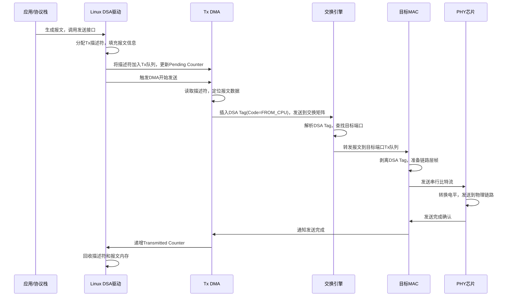

##  Marvell交换芯片：从CPU发包到MAC转发的完整流程（DSA架构下）

以Marvell 88E6xxx系列（典型DSA交换芯片）为例，整个流程可以分为**CPU侧准备**、**DSA标签注入**、**交换芯片内部转发**、**MAC层发送**四个核心阶段。

#### 1. 🔧 CPU侧：报文组装与驱动下发 

1. **应用/协议栈生成报文**：CPU生成需要发送的报文（如ARP、管理帧、FROM_CPU类型报文），封装成`mbuf`或`sk_buff`。

2. **驱动填充Tx描述符**：    
   - 驱动从空闲描述符池获取一个Tx描述符，填入报文的**物理地址、长度、控制信息**（如端口号、优先级）。    - 写入目标端口信息（对应你结构体里的`uiUnitID`/`uiModID`/`uiDPortNo`），标记为**FROM_CPU**类型。 
   
 3. **更新DMA队列**：将描述符挂到Tx队列尾部，递增`Pending Descriptors Counter`，通知DMA硬件有新包待发。 
 4.  **触发DMA**：驱动写寄存器，唤醒Tx DMA开始取描述符。

#### 2. 🏷️ DSA标签注入（关键！Marvell私有机制）

1.  **DMA读取描述符**：Tx DMA按`Next Descriptor Index`从内存读取描述符，定位到报文数据。 
2.  **插入DSA Tag**：    - 芯片根据驱动配置的目标信息（芯片ID、端口号、FROM_CPU标记），在**以太网帧源MAC和类型字段之间**插入4/8字节的DSA Tag。    - Tag中包含：`Code=FROM_CPU`、`TrgDev=目标芯片ID`、`TrgPort=目标物理端口`。 
3.  **帧格式修正**：更新帧长度字段，确保L2校验和正确。 

####  3. 🔄 交换芯片内部转发

1. **帧进入交换矩阵**：打了DSA Tag的报文进入芯片内部的交换引擎（Switch Fabric）。 2.  **解析DSA Tag**：交换引擎识别`Code=FROM_CPU`，解析出目标芯片和端口：    - 若目标端口在**本芯片**：直接转发到对应MAC端口。    - 若目标端口在**级联芯片**：通过DSA级联端口转发到下一级芯片，下一级芯片剥离Tag后再转发。 3.  **VLAN/ACL检查**：按配置进行VLAN过滤、ACL规则匹配、QoS调度（如优先级队列）。 4.  **队列调度**：报文进入目标端口的Tx队列，等待调度发送（严格优先级/WRR等算法）。 

#### 📡 MAC层物理发送

1.  **MAC模块取包**：目标端口的MAC从Tx队列取出报文，剥离DSA Tag（如果是级联后到达）。 
2.  **链路层处理**：    
    - 填充前导码（Preamble）、帧起始定界符（SFD）。    
    - 计算并插入CRC校验和（FCS）。    
    - 若链路为半双工，执行CSMA/CD冲突检测。 
3. **PHY层发送**：MAC将串行比特流发送给PHY芯片，PHY完成电平转换（如SGMII→RJ45），最终在物理链路上发出。 
4. **状态回写**：发送完成后，芯片递增`Transmitted Buffer Counter`，通知CPU可以回收描述符和报文内存。
---
### ⚠️ 常见丢包卡点（结合你之前的问题） 
如果你的FROM_CPU报文发不出去，大概率卡在以下环节：
1.  **CPU侧**：Tx描述符未正确挂入队列，`Pending Descriptors Counter`未更新，DMA未被触发。 
2.  **DSA Tag**：Tag中`TrgDev`/`TrgPort`配置错误，芯片找不到目标端口，直接丢弃。 
3.  **交换引擎**：VLAN/ACL规则拒绝转发，或目标端口未up/被隔离。
4.  **MAC/PHY**：端口链路down、流控拥塞、PHY故障导致无法发送。 

### 📊 流程时序图（Mermaid） 

### 💡 调试建议
- 用`printk`打印你的`Drv_RxTx_TxInfo_S`结构体，确认`uiUnitID`/`uiModID`/`uiDPortNo`是否和硬件拓扑一致。 
- 读芯片寄存器：`PTXDQA`/`PTXDQS`确认队列配置，`Transmitted Buffer Counter`确认是否真的发送了。 
- 抓Conduit端口报文：看是否有带FROM_CPU Tag的报文发出，确认Tag字段是否正确。 --- 要不要我帮你整理一份**Marvell芯片FROM_CPU发包失败的排查 Checklist**，按步骤定位是CPU侧、DSA Tag还是交换层的问题？