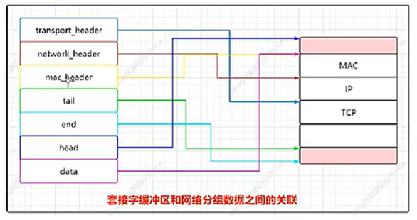
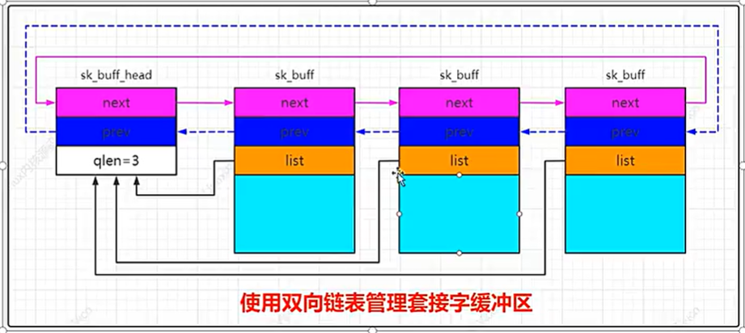

# 一 套接字通信
## ISO参考模型和TCP/IP参考模型
ISO是七层，物理层/传输层
应用层：网络服务与最终用户的接口
表示层：数据的表示、安全、压缩：格式jpeg/ascii等
会话层：建立、管理及终止回话：
传输层：定义传输数据的协议，以及流控和差错校验（数据包一旦离开网卡进入网络传输层）
网络层：进行逻辑地址建立、实现不同网络之间的路由选择。
链路层：建立逻辑连接、进行硬件地址寻址、差错检验等功能。
物理层：

核心术语
数据帧（frame）：一种信息单位，起始点都是数据链路层
数据包（Packet）：起始位置是网络层
数据报（Datagram）：通常起始点使用无连接网络服务的网络层的信息单元
段（Segment）：起始点和目的都是传输层的信息单元
消息（Message）：经常用于应用层
元素（cell）：一种固定长度的信息

各层执行任务
主机到网络层负责将信息从一台计算机传输到远程计算机。它处理传输截止的物理性质，并将数据流划分为定长的帧，以便于在发生传输错误时重传数据块。

1. 内核开发工程师将这些头文件存储到一个专门的目录 include/net中，而不是存储到标准位置 include/linux。
2. 计算机之间通信是一个复杂的问题，如何建立物理连接？使用什么样的线缆？通信介质有哪些限制和特殊的要求？如何处理传输错误？如何识别一个计算机？

### 1 创建套接字
套接字不仅可以用于各种传输协议的IP连接，也可以用于内核支持的所有其他地址和协议类型（例如IPX、appletalk，本地unix套接字

```c
// include/linux/socket.h
struct sockaddr {
	sa_family_t	sa_family;	/* address family, AF_xxx	*/
	char		sa_data[14];	/* 14 bytes of protocol address	*/
};
// sa_family: 是地址家族，一般都是以AF_XXX形式出现，比如大多数都是用AF_INET，代表TCP/IP协议族
// sa_data:是14字节协议地址
//这个数据结构用作bind， connect， recvfrom, sendto等函数的参数，用于指明地址信息


/* Structure describing an Internet socket address.  */
struct sockaddr_in
  {
    __SOCKADDR_COMMON (sin_);
    in_port_t sin_port;			/* Port number.  采用网络数据格式*/
    struct in_addr sin_addr;		/* Internet address. IP地址 */

    /* Pad to size of `struct sockaddr'.  */
    unsigned char sin_zero[sizeof (struct sockaddr) // 只是为了对齐
			   - __SOCKADDR_COMMON_SIZE
			   - sizeof (in_port_t)
			   - sizeof (struct in_addr)];
  };

/* Internet address.  */
typedef uint32_t in_addr_t;
struct in_addr
  {
    in_addr_t s_addr;
  };


```

struct in_addr 其实就是一个32位的IP地址
Struct sockaddr是通用的套接字地址，struct sockaddr_in是Internet环境下套接字的地址形式，二者长度为16字节，指向socket

sockaddr_in结构的指针也可以指向sockaddr，一般情况下，需要吧sockaddr_in结构强制转换成sockaddr结构再传入系统调用函数当中

BSD网络软件中包含两个重要的函数：inet_addr, inet_ntoa。用来在二进制地址格式和点分十进制字符串之间

### 2 使用套接字
在服务端的模型中，通常提前创建多个子进程，当客户端的请求到来的时候，系统从进程池中选取一个子进程处理客户端的请求，每个子进程处理一个客户端的请求，在全部子进程的处理能力得到满足之前，服务器的网络负载是基本不变的。（只是例子）

server     start -> socket() -> bind() -> fork() -> wait -> end
client     loop (accept() -> recv() -> process data )

TCP 并发服务器简单案例
TCP并发服务器，在处理客户端请求之前，程序先分叉成3个子进程，对应多个客户端的请求，由多个子进程进行处理，与循环服务器相比较，并发的方式在处理请求时，不在只用一个while做串行处理，而是用fork分到子进程中处理。

### 3 套接字缓冲区管理数据
在内核分析(收到)网络分组时，底层协议的数据将传递到更高的层。发送数据时顺序相反，各种协议产生的数据(首部和净荷)依次向更低的层传递，直至最终发送。这些操作的速度对网络子系统的性能有决定性的影响，因此内核使用一种特殊的结构，称为套接字缓冲区(socket buffer)，具体源码分析如下:
```c
// include\linux\skbuff.h 表示网络数据包，是一个双向链表

struct sk_buff {
	union {
		struct {
			/* These two members must be first. */
			struct sk_buff		*next;   /* sk_buff是双向链表，指向前进指针 */
			struct sk_buff		*prev;      // 指向前一个sk_buff结构体指针

			union {
                // 收到此报文的网络设备（指定处理分组的网络设备）
				struct net_device	*dev;
				/* Some protocols might use this space to store information,
				 * while device pointer would be NULL.
				 * UDP receive path is one user.
				 */
				unsigned long		dev_scratch;
			};
		};
		struct rb_node		rbnode; /* used in netem, ip4 defrag, and tcp stack */
		struct list_head	list;
	};

	union {
		struct sock		*sk;        // 本网络报文所属的sock结构，此值仅在本地发出的报文中有效，从网络收到的报文这个为空
		int			ip_defrag_offset;
	};

	union {
		ktime_t		tstamp;     // 报文收到的时间戳
		u64		skb_mstamp_ns; /* earliest departure time */
	};
	/*
	 * This is the control buffer. It is free to use for every
	 * layer. Please put your private variables there. If you
	 * want to keep them across layers you have to do a skb_clone()
	 * first. This is owned by whoever has the skb queued ATM.
	 */
	char			cb[48] __aligned(8);    // 用于控制缓冲区

	union {
		struct {
			unsigned long	_skb_refdst;
			void		(*destructor)(struct sk_buff *skb);
		};
		struct list_head	tcp_tsorted_anchor;
	};

#if defined(CONFIG_NF_CONNTRACK) || defined(CONFIG_NF_CONNTRACK_MODULE)
	unsigned long		 _nfct;
#endif
	unsigned int		len,        // 有效数据长度
				data_len;           // 数据长度
	__u16			mac_len,        // MAC报文长度
				hdr_len;            // skb的可写头部长度

	/* Following fields are _not_ copied in __copy_skb_header()
	 * Note that queue_mapping is here mostly to fill a hole.
	 */
	__u16			queue_mapping;

/* if you move cloned around you also must adapt those constants */
#ifdef __BIG_ENDIAN_BITFIELD
#define CLONED_MASK	(1 << 7)
#else
#define CLONED_MASK	1
#endif
#define CLONED_OFFSET()		offsetof(struct sk_buff, __cloned_offset)

	/* private: */
	__u8			__cloned_offset[0];
	/* public: */
	__u8			cloned:1,
				nohdr:1,
				fclone:2,
				peeked:1,
				head_frag:1,
				pfmemalloc:1;
#ifdef CONFIG_SKB_EXTENSIONS
	__u8			active_extensions;
#endif
	/* fields enclosed in headers_start/headers_end are copied
	 * using a single memcpy() in __copy_skb_header()
	 */
	/* private: */
	__u32			headers_start[0];
	/* public: */

/* if you move pkt_type around you also must adapt those constants */
#ifdef __BIG_ENDIAN_BITFIELD
#define PKT_TYPE_MAX	(7 << 5)
#else
#define PKT_TYPE_MAX	7
#endif
#define PKT_TYPE_OFFSET()	offsetof(struct sk_buff, __pkt_type_offset)

	/* private: */
	__u8			__pkt_type_offset[0];
	/* public: */
	__u8			pkt_type:3;
	__u8			ignore_df:1;
	__u8			nf_trace:1;
	__u8			ip_summed:2;
	__u8			ooo_okay:1;

	__u8			l4_hash:1;
	__u8			sw_hash:1;
	__u8			wifi_acked_valid:1;
	__u8			wifi_acked:1;
	__u8			no_fcs:1;
	/* Indicates the inner headers are valid in the skbuff. */
	__u8			encapsulation:1;
	__u8			encap_hdr_csum:1;
	__u8			csum_valid:1;

#ifdef __BIG_ENDIAN_BITFIELD
#define PKT_VLAN_PRESENT_BIT	7
#else
#define PKT_VLAN_PRESENT_BIT	0
#endif
#define PKT_VLAN_PRESENT_OFFSET()	offsetof(struct sk_buff, __pkt_vlan_present_offset)
	/* private: */
	__u8			__pkt_vlan_present_offset[0];
	/* public: */
	__u8			vlan_present:1;
	__u8			csum_complete_sw:1;
	__u8			csum_level:2;
	__u8			csum_not_inet:1;
	__u8			dst_pending_confirm:1;
#ifdef CONFIG_IPV6_NDISC_NODETYPE
	__u8			ndisc_nodetype:2;
#endif

	__u8			ipvs_property:1;
	__u8			inner_protocol_type:1;
	__u8			remcsum_offload:1;
#ifdef CONFIG_NET_SWITCHDEV
	__u8			offload_fwd_mark:1;
	__u8			offload_l3_fwd_mark:1;
#endif
#ifdef CONFIG_NET_CLS_ACT
	__u8			tc_skip_classify:1;
	__u8			tc_at_ingress:1;
#endif
#ifdef CONFIG_NET_REDIRECT
	__u8			redirected:1;
	__u8			from_ingress:1;
#endif
#ifdef CONFIG_TLS_DEVICE
	__u8			decrypted:1;
#endif

#ifdef CONFIG_NET_SCHED
	__u16			tc_index;	/* traffic control index */
#endif

	union {
		__wsum		csum;
		struct {
			__u16	csum_start;
			__u16	csum_offset;
		};
	};
	__u32			priority;
	int			skb_iif;
	__u32			hash;
	__be16			vlan_proto;
	__u16			vlan_tci;
#if defined(CONFIG_NET_RX_BUSY_POLL) || defined(CONFIG_XPS)
	union {
		unsigned int	napi_id;
		unsigned int	sender_cpu;
	};
#endif
#ifdef CONFIG_NETWORK_SECMARK
	__u32		secmark;
#endif

	union {
		__u32		mark;
		__u32		reserved_tailroom;
	};

	union {
		__be16		inner_protocol;     // 协议
		__u8		inner_ipproto;
	};

	__u16			inner_transport_header;
	__u16			inner_network_header;   // IP头
	__u16			inner_mac_header;

	__be16			protocol;
	__u16			transport_header;       // 传输层头部，L4帧头
	__u16			network_header;         // IP帧头,指向IP结构体指针
	__u16			mac_header;             // 指向MAC头的指针

	/* private: */
	__u32			headers_end[0];
	/* public: */

	/* These elements must be at the end, see alloc_skb() for details.  */
	sk_buff_data_t		tail;           // 数据尾指针
	sk_buff_data_t		end;            // 报文缓冲区的尾部
	unsigned char		*head,          // 报文缓冲区的头
				*data;                  // 数据的头指针
	unsigned int		truesize;       // 报文缓冲区的大小
	refcount_t		users;              // skb被克隆引用的次数，在内存申请

#ifdef CONFIG_SKB_EXTENSIONS
	/* only useable after checking ->active_extensions != 0 */
	struct skb_ext		*extensions;
#endif
};
```

### 4 套接字缓冲区管理数据
套接字缓冲区的基本思想是，通过操作指针来增删协议首部。head和end指向数据在内存中的起始和结束位置。data和tail指向协议数据区域的起始和结束位置。mac_header指向mac协议首部的起始，而network_header和transport_header分别指向网络层和传输层协议首部的起始



在32位系统中，数据类型sk_buff_data_t用来表示各种类型为简单指针的数据，具体结构sk_buff_data_t如下所示：

```c
#ifdef NET_SKBUFF_DATA_USES_OFFSET
typedef unsigned int sk_buff_data_t;
#else
typedef unsigned char *sk_buff_data_t;
#endif
```

在套接字缓冲区传递到互联网时，必须增加一个新层。只需要向已经分配但尚未占用的那部分内存空间定稿的数据，除了data之外的所有指针都不变，data现在指向IP首部的起始处。对接收分组进行分析过程类似：分组数据复制到内核分配的一个内存区中，并在整个分析期间一直处于该内存中。与该分组关联的套接字缓冲区在各层之间顺序传递。

从套接字缓冲区获取TCP首部：
```c
// include -> linux -> tcp.h
static inline struct tcphdr *tcp_hdr(const struct sk_buff *skb)
{
	return (struct tcphdr *)skb_transport_header(skb);
}
// include -> linux -> udp.h
static inline struct udphdr *udp_hdr(const struct sk_buff *skb)
{
	return (struct udphdr *)skb_transport_header(skb);
}

```

### 5 Linux内核提供操作套接字缓冲区的标准函数如下：

```c
// linux\include\linux\skbuff.h
/**
 * alloc_skb - allocate a network buffer
 * @size: size to allocate
 * @priority: allocation mask
 *
 * This function is a convenient wrapper around __alloc_skb().
 */
static inline struct sk_buff *alloc_skb(unsigned int size,
					gfp_t priority)		//分配一个新的sk_buff实例
{
	return __alloc_skb(size, priority, 0, NUMA_NO_NODE);
}

// net\core\skbuff.c
/**
 *	skb_copy	-	create private copy of an sk_buff
 *	@skb: buffer to copy
 *	@gfp_mask: allocation priority
 *
 *	Make a copy of both an &sk_buff and its data. This is used when the
 *	caller wishes to modify the data and needs a private copy of the
 *	data to alter. Returns %NULL on failure or the pointer to the buffer
 *	on success. The returned buffer has a reference count of 1.
 *
 *	As by-product this function converts non-linear &sk_buff to linear
 *	one, so that &sk_buff becomes completely private and caller is allowed
 *	to modify all the data of returned buffer. This means that this
 *	function is not recommended for use in circumstances when only
 *	header is going to be modified. Use pskb_copy() instead.
 */

struct sk_buff *skb_copy(const struct sk_buff *skb, gfp_t gfp_mask)	// 创建套接字缓冲区和相关数据的一个副本
{
	int headerlen = skb_headroom(skb);
	unsigned int size = skb_end_offset(skb) + skb->data_len;
	struct sk_buff *n = __alloc_skb(size, gfp_mask,
					skb_alloc_rx_flag(skb), NUMA_NO_NODE);

	if (!n)
		return NULL;

	/* Set the data pointer */
	skb_reserve(n, headerlen);
	/* Set the tail pointer and length */
	skb_put(n, skb->len);

	BUG_ON(skb_copy_bits(skb, -headerlen, n->head, headerlen + skb->len));

	skb_copy_header(n, skb);
	return n;
}
EXPORT_SYMBOL(skb_copy);


/**
 *	skb_clone	-	duplicate an sk_buff
 *	@skb: buffer to clone
 *	@gfp_mask: allocation priority
 *
 *	Duplicate an &sk_buff. The new one is not owned by a socket. Both
 *	copies share the same packet data but not structure. The new
 *	buffer has a reference count of 1. If the allocation fails the
 *	function returns %NULL otherwise the new buffer is returned.
 *
 *	If this function is called from an interrupt gfp_mask() must be
 *	%GFP_ATOMIC.
 */

struct sk_buff *skb_clone(struct sk_buff *skb, gfp_t gfp_mask)		// 创建套接字缓冲区的一个副本，但原本和副本将使用同一个分组数据
{
	struct sk_buff_fclones *fclones = container_of(skb,
						       struct sk_buff_fclones,
						       skb1);
	struct sk_buff *n;

	if (skb_orphan_frags(skb, gfp_mask))
		return NULL;

	if (skb->fclone == SKB_FCLONE_ORIG &&
	    refcount_read(&fclones->fclone_ref) == 1) {
		n = &fclones->skb2;
		refcount_set(&fclones->fclone_ref, 2);
	} else {
		if (skb_pfmemalloc(skb))
			gfp_mask |= __GFP_MEMALLOC;

		n = kmem_cache_alloc(skbuff_head_cache, gfp_mask);
		if (!n)
			return NULL;

		n->fclone = SKB_FCLONE_UNAVAILABLE;
	}

	return __skb_clone(n, skb);
}
EXPORT_SYMBOL(skb_clone);

static inline int skb_tailroom(const struct sk_buff *skb);   // 返回数据末端空闲空间的长度
static inline unsigned int skb_headroom(const struct sk_buff *skb);  	// 返回数据起始处空闲的长度
struct sk_buff *skb_realloc_headroom(struct sk_buff *skb, unsigned int headroom);   // 在数据起始处创建更多的空闲空间，现在数据不变

```
### 6 指向传输层首部的指针计算如下：
```c
static inline unsigned char *skb_transport_header(const struct sk_buff *skb)
{
	return skb->head + skb->transport_header;
}
```
因4字节偏移量足以描述长达4GB的内存区，套接字缓冲区不可能超过这个长度

```c
static inline void skb_reset_transport_header(struct sk_buff *skb)		// 将传输层首部重置为数据部分的起始位置
{
	skb->transport_header = skb->data - skb->head;
}

static inline void skb_set_transport_header(struct sk_buff *skb, const int offset)	// 根据数据部分中给定的偏移量来设置传输层首部的起始位置			
{
	skb_reset_transport_header(skb);
	skb->transport_header += offset;
}
```
## 管理套接字缓冲区数据
套接字缓冲区结构不仅包含上述指针，还包括用于处理相关的数据和管理套接字缓冲区自身的其他成员。下面列出的是一些最重要的成员。
* tsstamp保存了分组到达的时间。
* dev指定了处理分组的网络设备。
* sk是一个指针，指向用于处理该分组的套接字对应的socket实例。
* dst表示接下来该分组通过内核网络实现的路由
* next和prev用于将套接字缓冲区保存到一个双链表中

```c
/* 使用一个表头来实现套接字缓冲区的等待队列 */
struct sk_buff_head {
	/* These two members must be first. */
	struct sk_buff	*next;
	struct sk_buff	*prev;

	__u32		qlen;	// head后面有几个sk_buff链表节点
	spinlock_t	lock;
};
```
使用双向链表管理套接字缓冲区如下：

